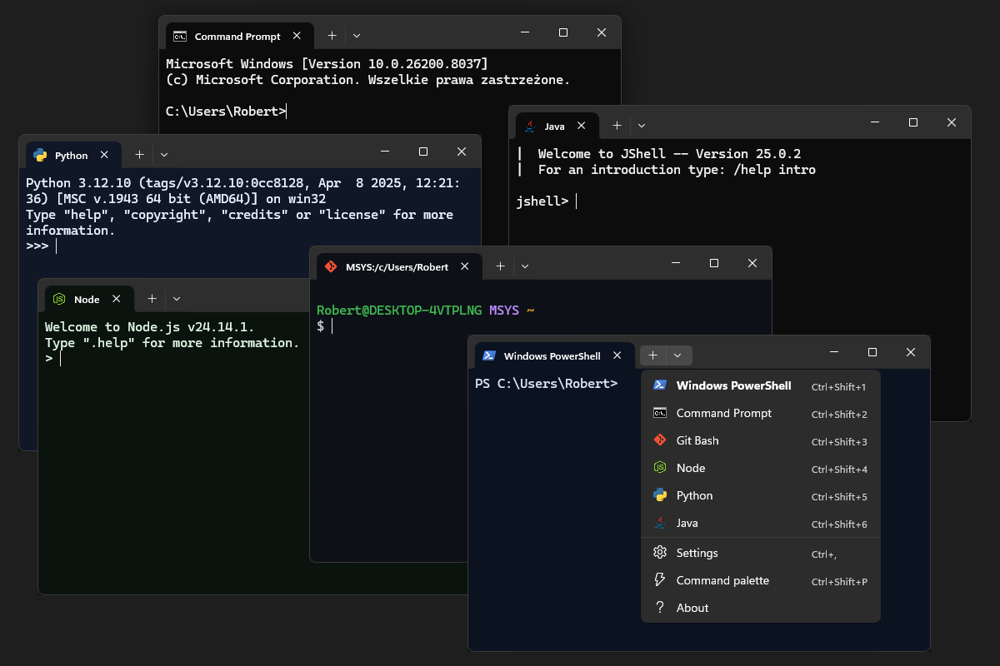

# Setup-Terminal

  

Setup-Terminal is a PowerShell_5-based setup project for applying a consistent Windows Terminal configuration on a developer workstation.

The project currently focuses on detecting common developer runtimes, creating Windows Terminal profiles for them, and optionally configuring an Oh My Posh prompt for PowerShell.

This script only reaches web in order to download:

- Oh My Posh through `winget`
- FiraCode Nerd Font ZIP from a tagged official Nerd Fonts GitHub release
- Oh My Posh `themes.zip` archive from the current GitHub release

Direct file downloads are verified with SHA-256 before the downloaded file is used. The Nerd Font archive is downloaded from a tagged release and checked against the checksum file published with the same Nerd Fonts release. The Oh My Posh themes archive is downloaded from the current release, checked against the SHA-256 digest exposed by the GitHub release asset, and only the selected theme file is extracted.

<p align="center">
  
</p>

## What It Configures

- Windows Terminal `settings.json`
- Developer profiles for detected tools:
  - Git Bash
  - Python
  - Node.js
  - Java (only detection)
- Profile icons for supported developer tools
- Selected Windows Terminal dynamic profile sources
- Terminal color schemes
- Additional Windows Terminal profile settings
- Oh My Posh setup for PowerShell
- FiraCode Nerd Font installation from the official Nerd Fonts ZIP archive
- Oh My Posh theme setup from the verified release themes archive
- Basic terminal behavior settings, such as tab width mode and web search URL


## Requirements

- Windows
- Windows Terminal
- PowerShell
- Git, Python, and Node.js, Java installed if you want matching profiles to be generated
  - best to install using: official installer, Python version manager, Node version manager, Java JDK Adoptium Temurin

- `winget` if you want the setup to install or upgrade Oh My Posh

## Usage

Run the setup script from the repository root:

```powershell
.\Setup-Terminal.ps1
```

The script detects installed developer tools, updates Windows Terminal profiles, applies additional settings, and saves the configuration back to the active Windows Terminal `settings.json`.

If the interactive TUI cannot use the current host, the script falls back to text input mode. In that mode select profiles by typing combined numbers:

- `1` Git
- `2` Python
- `3` Node.js
- `4` Java

Then select setup steps by typing combined letters:

- `a` Update Windows Terminal profiles (+ profile icons)
- `b` Remove profiles outside Windows PowerShell and Command Prompt
- `c` Disable selected dynamic profile sources (Azure, SSH)
- `d` Apply profiles color schemes
- `e` Apply additional profile settings
- `f` Apply additional terminal settings
- `g` Install/configure Oh My Posh

For example, `134` selects Git, Node.js, and Java profiles, and `abc` selects the first three setup steps.

## Side effects

The script will download files from the web only after asking for permission with reference to the source URL.

Direct downloaded files are written to a temporary location first and verified before use:

- `FiraCode.zip` from the tagged Nerd Fonts GitHub release is verified against `SHA-256.txt` from the same release.
- `themes.zip` from the current Oh My Posh GitHub release is verified against the SHA-256 digest exposed by the release asset metadata. The setup extracts only `marcduiker.omp.json` from that archive.

Oh My Posh itself is installed or upgraded through `winget`, which uses the configured winget package source.

Additionally the script modifies the files in system locations as follows:

echo "$HOME\AppData\Local\Packages\Microsoft.WindowsTerminal_8wekyb3d8bbwe\LocalState\icons"
echo "$HOME\AppData\Local\Packages\Microsoft.WindowsTerminal_8wekyb3d8bbwe\LocalState\marcduiker.omp.json"
echo "$HOME\Documents\WindowsPowerShell\Microsoft.PowerShell_profile.ps1"
echo "$HOME\Documents\PowerShell\Microsoft.PowerShell_profile.ps1"
echo "$HOME\AppData\Local\Packages\Microsoft.WindowsTerminal_8wekyb3d8bbwe\LocalState\settings.json"

## Project Structure

```text
Setup-Terminal.ps1              Main setup script
modules/                        PowerShell modules used by the setup script
resources/                      Shared icons and other project assets
```

## Asset Attribution

This project includes `resources/ps_fluent_design_384.svg` for README branding.

The icon is not my original asset. It comes from the official PowerShell repository:

[PowerShell Fluent Design icon](https://github.com/PowerShell/PowerShell/blob/master/assets/ps_fluent_design_384.svg)

The upstream PowerShell repository is licensed under the MIT License.

## License

Project license is not defined yet.
